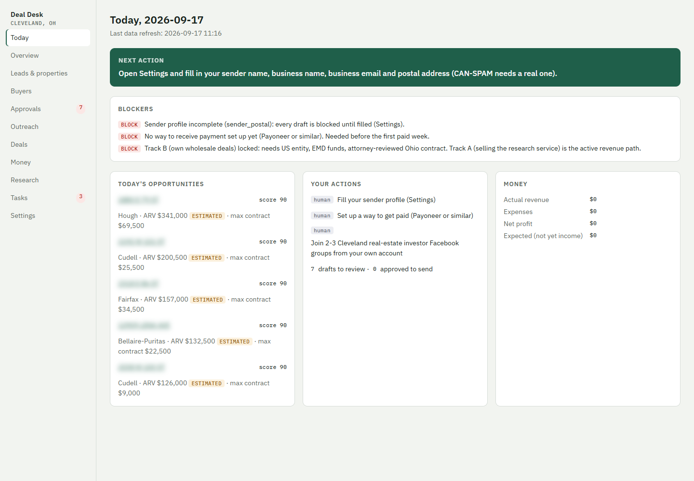
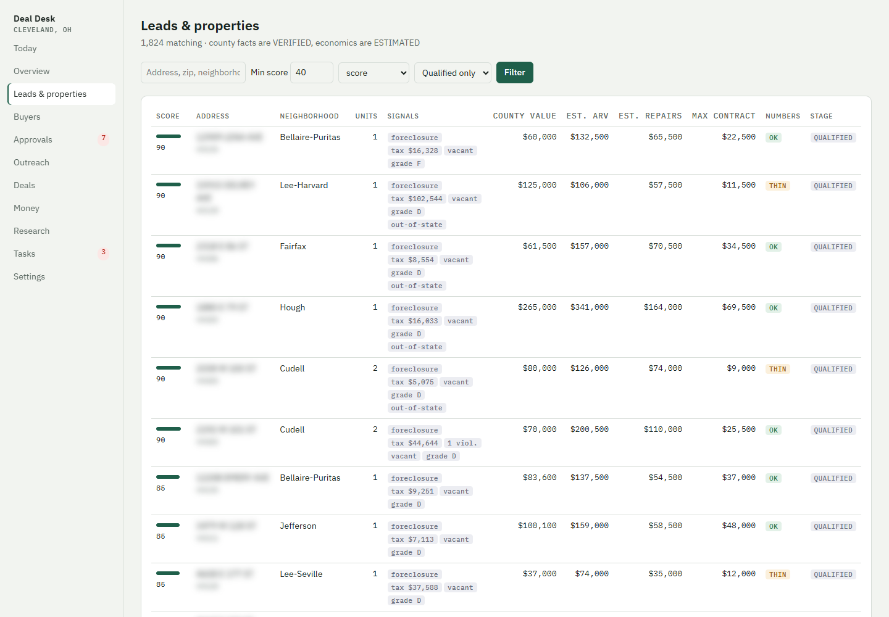
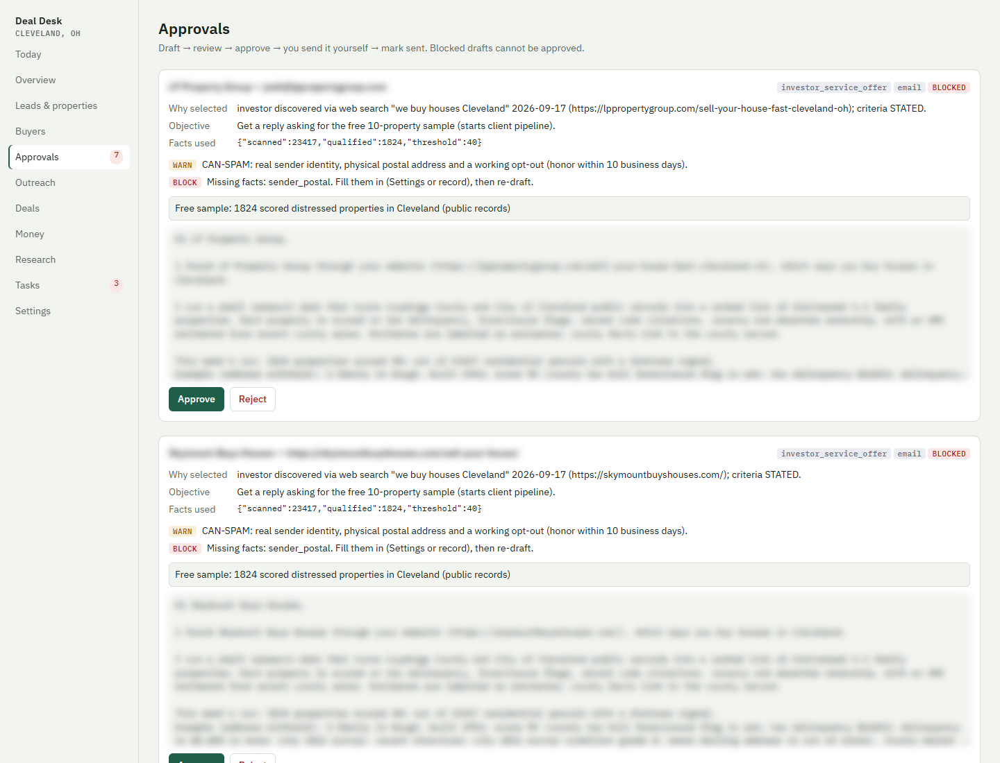
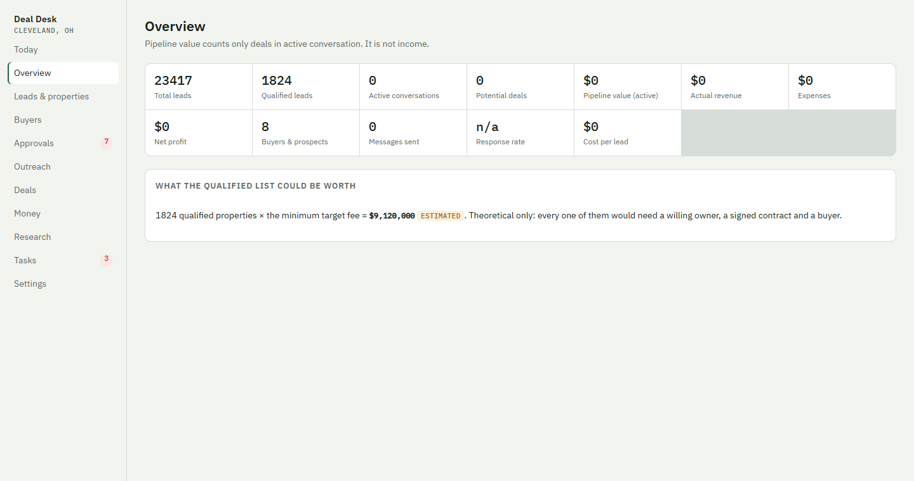
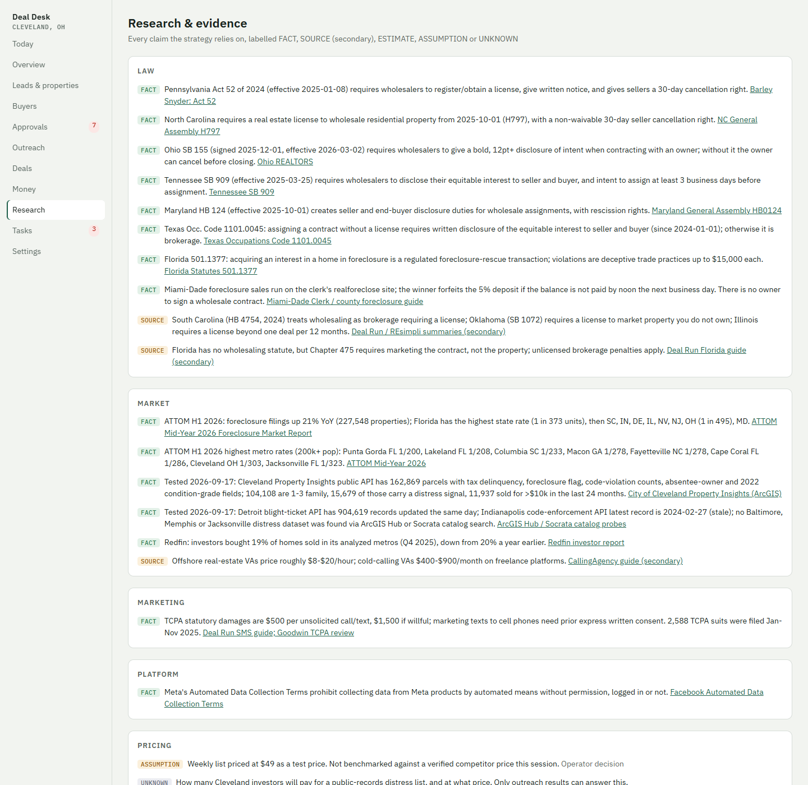
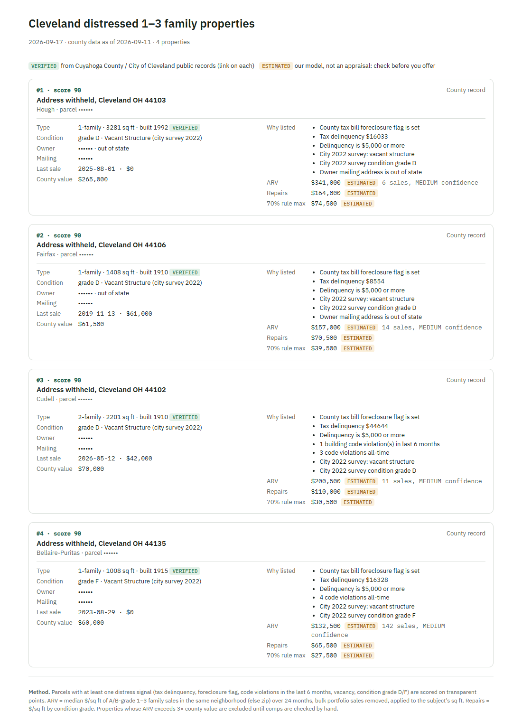
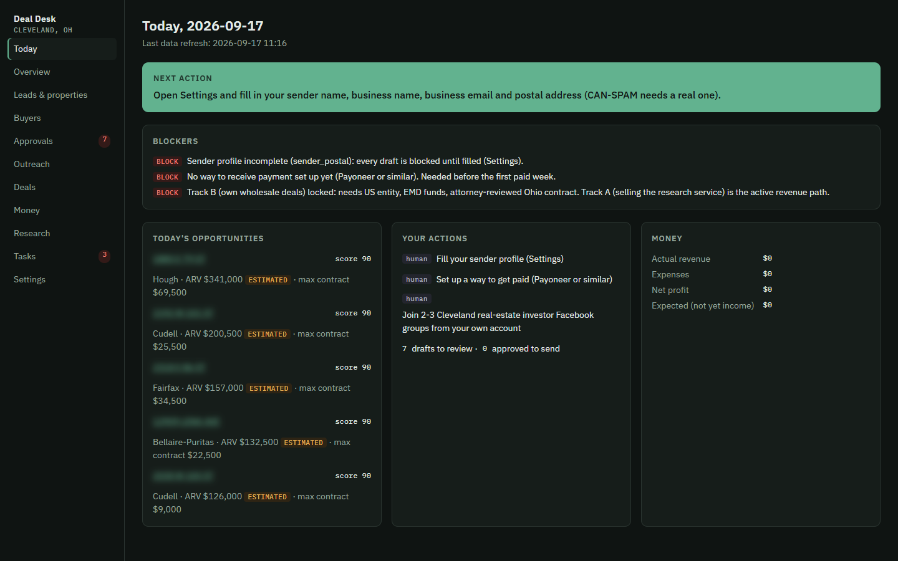
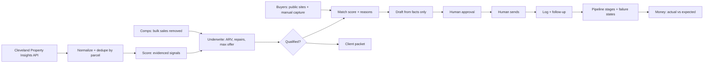

# Deal Desk

**A remote real-estate research desk.** It turns Cleveland, Ohio public records into a ranked list of distressed houses, underwrites each one, matches them to investors' stated buying criteria, and runs outreach through a human approval gate.

Built for one operator working from Pakistan, at $0 data cost, on a local Node.js + SQLite stack. Source code is private; this repo shows the product.

## What it does

| Stage | How |
|---|---|
| **Find** | Pulls the City of Cleveland *Property Insights* public API: county auditor tax data, city code violations, the 2022 property survey |
| **Score** | Transparent distress points: foreclosure flag, tax delinquency, recent code violations, vacancy, poor condition, out-of-state owner, long ownership. Every point shows its evidence |
| **Underwrite** | ARV = median $/sq ft of renovated-grade sales nearby (bulk portfolio deeds removed), repairs by condition grade, 70%-rule max offer. Anything above 3× county value is flagged *verify* |
| **Label** | Every field is **VERIFIED** (public record, dated), **ESTIMATED** (with method) or **UNKNOWN**. Nothing is guessed silently |
| **Match** | Buyer criteria captured from public posts and websites (areas, types, price, rehab tolerance) → match score with reasons and blockers |
| **Outreach** | Drafts built only from stored facts. A missing fact blocks approval. Draft → review → approve → human sends → log → follow-up task |
| **Pipeline** | Lead → … → revenue, with failure states (bad numbers, no response, legal issue, …) and money tracking that never counts expected income as revenue |
| **Deliver** | Printable client packets: the weekly ranked list a customer pays for |

## First live run (2026-09-17)

- 11,937 recent sales loaded as comps (1,681 bulk-portfolio rows removed)
- **23,417** distressed 1–3 family parcels scored
- **1,824** qualified (score ≥ 40, numbers work)
- 8 local cash-buyer companies found; 7 verified by reading their sites, 1 dead site dropped

## Screenshots

Addresses, owner names and message bodies are blurred in these images.

| | |
|---|---|
|  |  |
|  |  |
|  |  |

## Architecture

## Compliance is part of the design

The app was built after researching why the popular "find a house on auction.com, post it in Facebook groups" wholesaling method fails. The full reasoning, with sources, is in [docs/STRATEGY.md](docs/STRATEGY.md).

- **Won't market a property without a contract.** The pipeline blocks it without a signed, disclosed (Ohio SB 155), professionally reviewed contract.
- **No calls or texts.** TCPA exposure is $500–$1,500 per message.
- **No Facebook scraping or automated posting** (Meta's Automated Data Collection Terms).
- **Emails carry real sender identity, a postal address, and an opt-out** (CAN-SPAM).
- **The software never sends anything.** A human approves and sends every message.

## Stack

Node.js 22+ (built-in `node:sqlite`, `node:http`, `node:test`), zero npm dependencies, vanilla HTML/CSS/JS dashboard with light and dark themes, ArcGIS REST public data.
